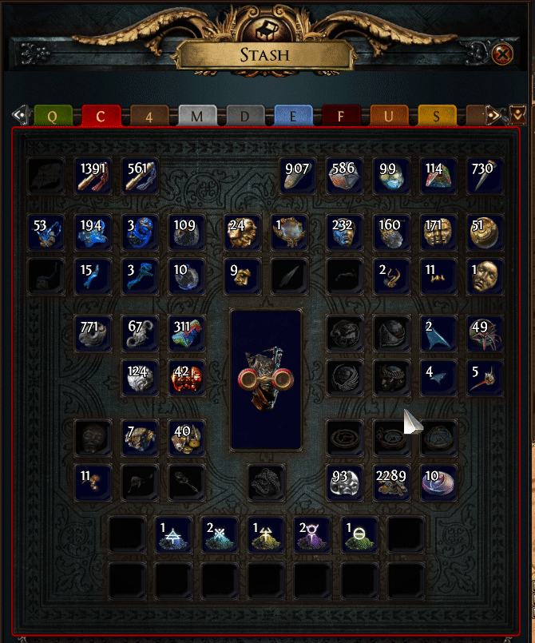

# Pypit
Python companion script for PoE

- **Pricechecks** items on Ctrl-d  
price info is taken from [poe.ninja](https://poe.ninja/)
- Teleports you to **hideout** (with `/hideout`) on F5



## Requirements
- [Python](https://www.python.org/downloads/)

## Installation
- [Download](https://github.com/dotnest/Pypit/archive/dev.zip)/clone this repository  
keep in mind that this will download a dev branch for now
- Extract it
- Install required libraries for python  
`pip install -r requirements.txt`  
Windows users can try provided `requirements_install.bat`

## Usage
- Launch `main.pyw`  
you should see pink and black letter "P" appear in your taskbar if all went well
- When in game:  
press **Ctrl-d** to pricecheck an item under your cursor  
press **F5** to teleport to hideout
- Windows users might encounter a *feature* due to how `pynput` works for now  
if Pypit pricechecks items when only **Ctrl** is pressed - it seems to be in a state where it thinks that **d** is pressed down too  
you can use it for your convenience and look up prices with just Ctrl, in that case press **d** when you're done to "unstick" it  

## Linux

- Take a deep breath
- I had to install some additional python libraries on ubuntu to make Tkinter work  
google ["ubuntu install tkinter"](https://www.google.com/search?q=ubuntu+install+tkinter) in case of problems
- If you're getting `AttributeError: When using gi.repository you must not import static modules like "gobject"...`:  
try commenting out 6 lines of this try/except/else block in your pyperclip `__init__.py` file to force pyperclip to use xclip or other alternatives (found mine at `~/.local/lib/python3.8/site-packages/pyperclip/__init__.py`)  
```python
# Setup for the LINUX platform:
if HAS_DISPLAY:
    # try:
    #     import gtk  # check if gtk is installed
    # except ImportError:
    #     pass # We want to fail fast for all non-ImportError exceptions.
    # else:
    #     return init_gtk_clipboard()
```
- If you're having issues with `window_name.py` - check the link on the first line from that file